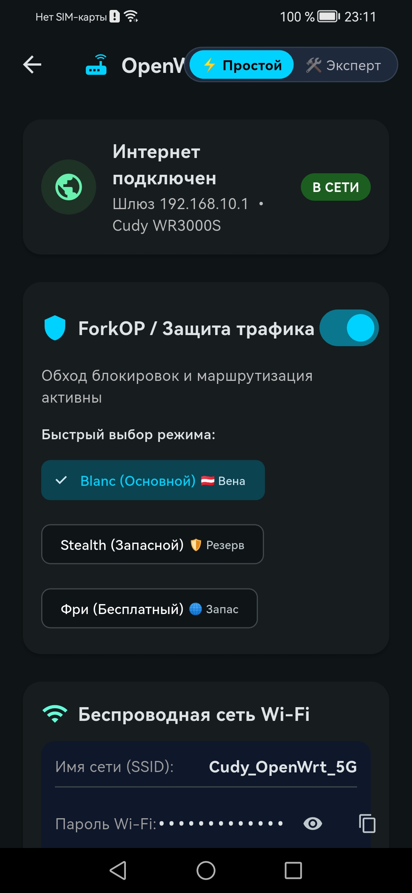
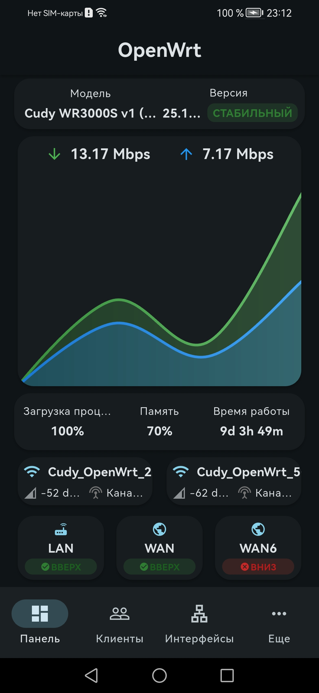
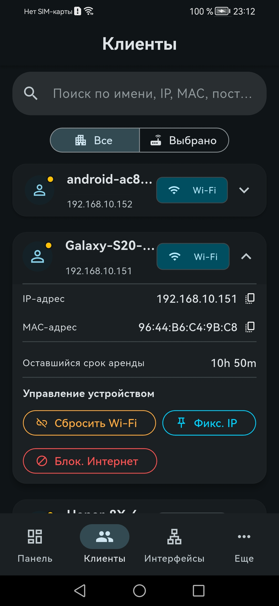
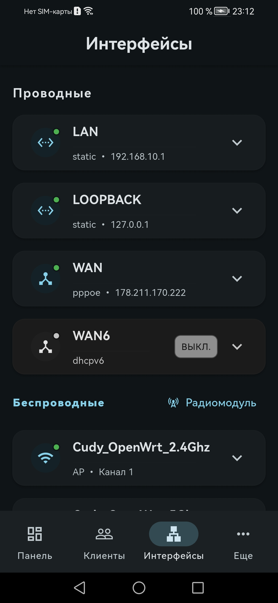
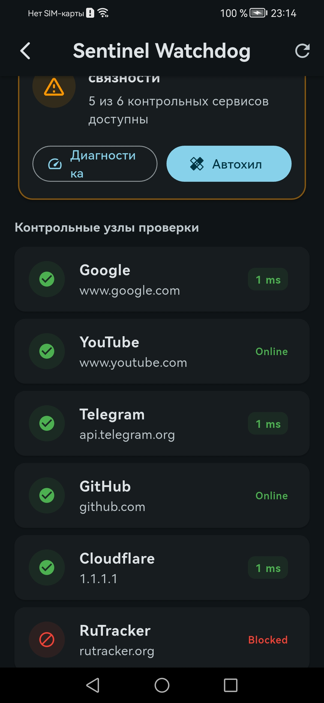
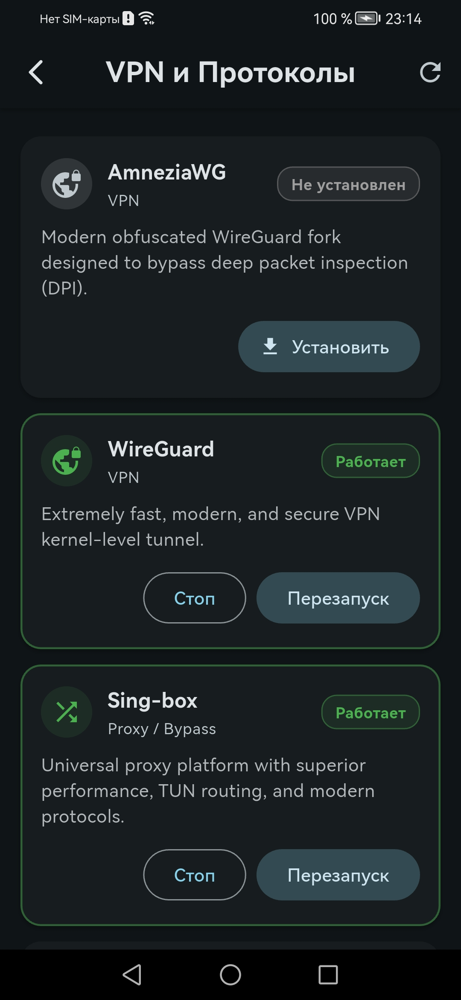
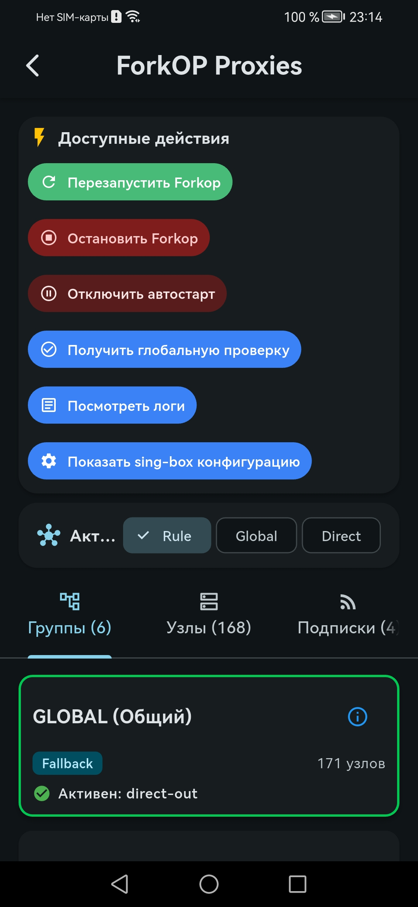
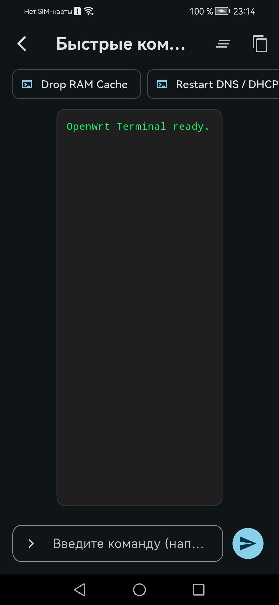
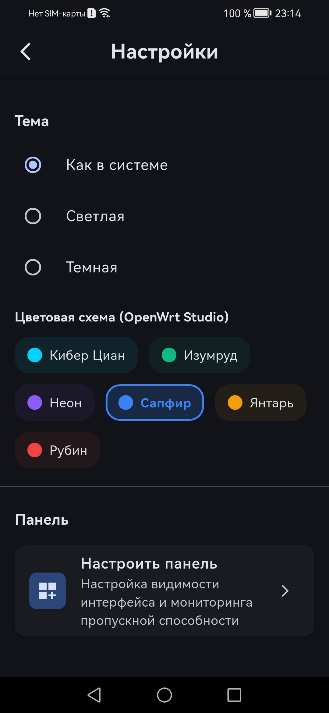
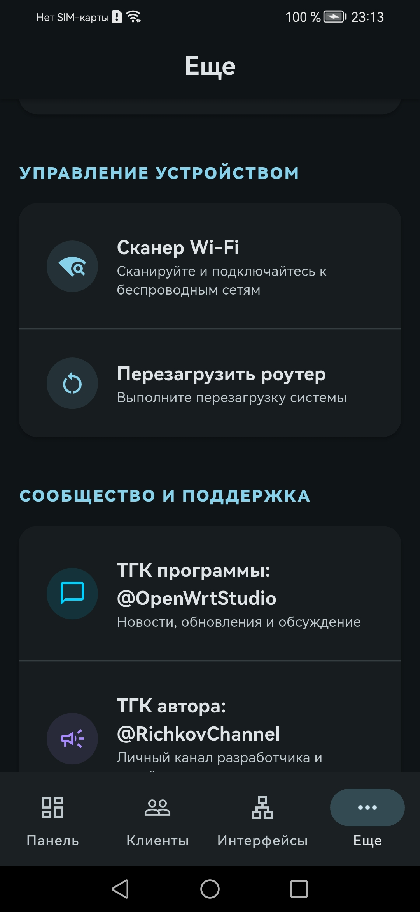

# 📱 OpenWrt Studio Mobile (Android)

  <h3>Расширенный мобильный клиент для OpenWrt на базе LuCI Mobile</h3>
  
Все возможности стокового LuCI Mobile + мощный арсенал OpenWrt Studio прямо на вашем смартфоне.

---

## 📸 Скриншоты интерфейса

| Простой режим | Экспертная панель | Управление клиентами |
| :---: | :---: | :---: |
|  |  |  |

| Сетевые интерфейсы | Sentinel Watchdog | VPN и Протоколы |
| :---: | :---: | :---: |
|  |  |  |

| ForkOP Прокси | Быстрые команды и терминал | Цветовые схемы | Сообщество и инструменты |
| :---: | :---: | :---: | :---: |
|  |  |  |  |

---

## 🌟 Возможности приложения

### ⚡ Расширенный функционал OpenWrt Studio:
1. **🌐 ForkOP (Узлы, Серверы, Подписки)**:
   - Поддержка ядер Mihomo (Clash Meta), Sing-box, PassWall 2, Xray.
   - Список всех прокси-серверов и селекторов (VLESS, VMess, Shadowsocks, Trojan, Hysteria 2, WireGuard, AmneziaWG).
   - Замер пинга (Latency / Delay test) в один клик по всем серверам.
   - Быстрое переключение активного сервера в группах `PROXY` / `GLOBAL`.
   - Выбор режима маршрутизации: `Rule` (по правилам), `Global` (весь трафик), `Direct` (напрямую).
   - Импорт и обновление подписок по ссылке.

2. **🛡️ VPN и Протоколы (Менеджер служб OpenWrt 24/25)**:
   - 7-уровневое сканирование установленных протоколов: AmneziaWG, WireGuard, Sing-box, Mihomo, PassWall 2, OpenVPN, Tailscale, ZeroTier, Xray.
   - Поддержка пакетных менеджеров `apk` (OpenWrt 24/25) и `opkg` (OpenWrt 23 и старше).
   - Просмотр статуса (Работает / Остановлен / Не установлен).
   - Быстрые кнопки управления: `Запустить`, `Остановить`, `Перезапуск`, `Установить`.

3. **👁️ Sentinel Watchdog (Мобильный сторожевой таймер)**:
   - Проверка обхода блокировок и связности ключевых сервисов (Google, YouTube, Telegram, GitHub, Cloudflare, RuTracker).
   - Замер задержки в мс до каждого узла.
   - Функция **Автохил**: перезапуск DNS (`dnsmasq`), сброс кэша и перезапуск туннеля в одно касание.

4. **💻 Быстрые команды и Мини-терминал**:
   - Быстрые действия: Очистка памяти RAM (`drop_caches`), перезагрузка правил Firewall 4 (`fw4 reload`), сброс DNS.
   - Просмотр системных журналов `logread` и логов ядра `dmesg`.
   - Ввод и выполнение любых команд shell прямо со смартфона.

5. **🎨 Цветовые схемы OpenWrt Studio (Fluent & Material 3)**:
   - Кибер Циан (`#00D2FF`)
   - Изумрудный Оазис (`#10B981`)
   - Киберпанк Неон (`#8B5CF6`)
   - Королевский Сапфир (`#3B82F6`)
   - Солнечный Янтарь (`#F59E0B`)
   - Рубиновый Закат (`#EF4444`)
   - Мгновенное переключение Светлой / Тёмной темы.

---

### 📦 Стоковые функции LuCI Mobile (полностью сохранены):
- Дашборд с нагрузкой CPU, RAM, аптаймом и графиками скорости в реальном времени.
- Список подключенных клиентов (DHCP-аренды, Wi-Fi ассоциации, определение производителей устройств по MAC).
- Управление проводными и беспроводными интерфейсами.
- Сканирование сетей Wi-Fi вокруг роутера.
- Поддержка профилей нескольких роутеров с безопасным хранением учетных данных (`flutter_secure_storage`).

---

## 💬 Сообщество и поддержка
- 📢 **Telegram-канал программы**: [@OpenWrtStudio](https://t.me/OpenWrtStudio)
- 📢 **Telegram-канал автора**: [@RichkovChannel](https://t.me/RichkovChannel)
- 🐛 **Сообщить о баге (Bug Report)**: [GitHub Issues](https://github.com/RichkovGit/OpenWrtStudio/issues)
- 🌐 **Десктопная версия**: [OpenWrtStudio](https://github.com/RichkovGit/OpenWrtStudio)

---

## 🚀 Скачать APK для Android

Готовые установочные файлы `.apk` собираются автоматически через GitHub Actions:
- **[Страница релизов GitHub Releases](../../releases)**

| Вариант | Описание |
|---|---|
| 📱 **app-arm64-v8a-release.apk** | Оптимизированный для современных 64-битных смартфонов (быстрее и компактнее) |
| 🛠️ **app-armeabi-v7a-release.apk** | Для 32-битных устаревших Android-устройств |
| 💻 **app-x86_64-release.apk** | Для эмуляторов Android на ПК |
| 📦 **app-release.aab** | Android App Bundle для публикации |

---

## 📄 Лицензия
Проект распространяется под свободной лицензией **GNU General Public License v3.0 (GPL-3.0)**.
Оригинальный проект: [cogwheel0/luci-mobile](https://github.com/cogwheel0/luci-mobile).
